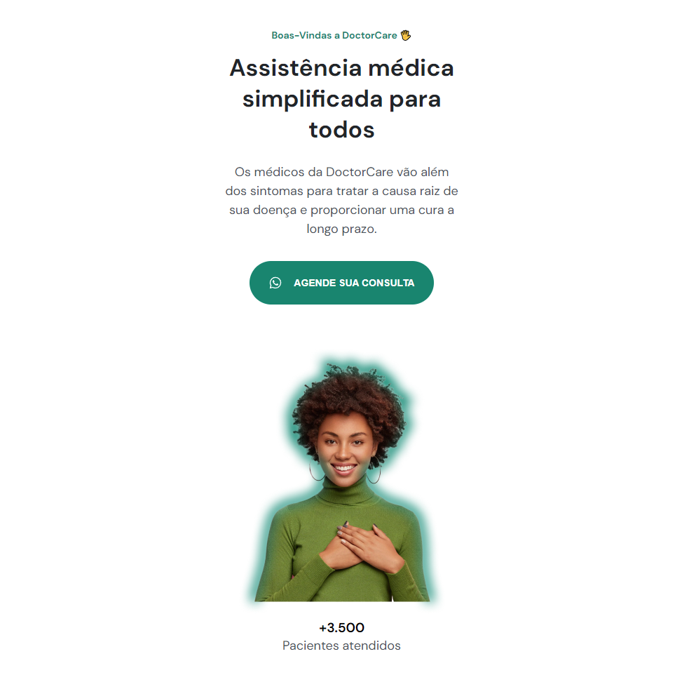

# DoctorCare

> Projeto criado pela [Rocketseat](https://rocketseat.com.br) no evento Next Level Week - Return.

**Objetivo do Projeto**

Criar uma Landing Page que possa ser reutilizada para diversas outras aplicações.

Nas video aulas, que aconteceram no periodo de 7 dias `01/05/2022 á 08/05/2022` , os instrutores ensinam os fundamentos de programação na web, utilizando as linguagens `HTML` e `CSS` .

**Tecnologias Utilizadas**

- [x] HTML
- [x] CSS
- [x] JavaScript

**Aulas Concluídas**

- [x] Aula 1 - O Ponto de Partida
- [x] Aula 2 - Aceleração máxima
- [ ] Aula 3 - Novas Habilidades
- [ ] Aula 4 - Não Definido
- [ ] Aula 5 - Não Definido

**Meus Objetivos após a finalização das aulas**

Concluir os desafios adicionais e transformar a página em uma Landing Page para a empresa de meu Pai.

## Resumo das Aulas

**Primeira Aula - O Ponto de Partida**

Na primeira aula o Educador **Mayk Brito** explica sobre os primeiros passos a serem dados na programação, sobre os fundamentos do HTML e CSS criando uma boa parte da aplicação como na imagem abaixo:

**Temas Ensinados**

- [x] HTML
  - [x] Tags
  - [x] Estrutura
  - [x] Referências
- [x] CSS
  - [x] CSS Variables
  - [x] Responsividade
  - [x] Alinhamento
  - [x] Caixa dentro de Caixa

**Segunda Aula - Aceleração máxima**

Na segunda aula, se explica sobre CSS Responsivo e javaScript

> Aprendemos a criar uma Barra Navigation para criar menus de navegação dentro do site

> Com javaScript aprendemos a introduzir uma classe CSS em um elemento HTML através de eventos

> Aprendemos a ocultar todos os elementos da página menos a barra de navegação para assim criar uma função javaScript que faça a tela focar somente nesta barra.

**Temas Ensinados**

- [x] CSS
  - [x] Responsivo
    - [x] Mobile First
  - [x] Layout
- [x] JavaScript
  - [x] Fluxo natural da aplicação
    - [x] Esquerda para direita
    - [x] Linha a linha
    - [x] Sincronismo
  - [x] Tipos de dados primitivos
    - [x] Strings
    - [x] Number
    - [x] Boolean
  - [x] Boas Práticas de escrita
    - [x] Em inglês
    - [x] `camelCase`
    - [x] Nomes Curtos, descritivos e intuitivos
  - [x] Tipos de Dados estruturados
    - [x] Funções
      - [x] Criar sequência de passos para aplicação
      - [x] Executar sequência
      - [x] exemplo: `alert('🔥 NLW')`
    - [x] Objetos
      - [x] Propriedades e Funcionalidades
        - [x] Atrivutos e métodos
      - [x] `{ prop:"value"}`
  - [x] Fluxo alternativo da aplicação
    - [x] Condicionais
      - [x] (if) se algo for verdadeiro, faz alguma coisa
      - [x] se for false (else) faz outra coisa
- [x] DOM
  - [x] O que é a DOM?
    - Document Object Model
  - [x] Referenciando tag HTML pelo atributo id
    - [x] Objeto: Propriedades e Funcionalidades

**Terceira Aula - Novas Habilidades**

> Na terceita aula, aprendemos sobre padronização de estrutura HTML e CSS e sobre utilização de Libs JavaScript.

> Aprendemos a criar `section` no HTML para separar as sessões de conteúdo da página

> Criamos a sessão Sobr (about), mas antes organizamos todo o HTML para ter um facil entendimento do que será construido, separando as estilizações globais das específicas no CSS tornando assim mais facil a leitura do documento e a criação de novas sessões utilizando a estrutura criada para auxiliar nas novas estilizações!

**Temas Ensinados**

- [x] HTML
  - [x] Padronizando a estrutura
  - [x] Tag `<section>`
  - [x] Adicionando âncoras
  - [x] Evento de clique no menu
  - [x] Seção serviços e sobre
- [x] CSS
  - [x] Seletor de id `#services, #about`
  - [x] Transições
  - [x] Rolagem suave (smooth scrolling)
    - [x] Sobreposição de elementos
    - [x] Menu
- [x] javaScript
  - [x] Obejetos
    - [x] Propriedades e Funcionalidades
      - [x] Atributos e Métodos
    - [x] `{ prop: "value"}`
    - [x] Atribuímos objeto à uma variável
    - [x] Vimos função que retorna objeto
      - [x] `return`
  - [x] Variável
    - [x] o que é? pra que serve?
    - [x] Criamos com a palavra reservada `var`
    - [x] existem outras maneiras de criar
  - [x] Tipo de dado
    - [x] `string` com Template Literals (Template String) ``
  - [x] Biblioteca de terceiros
    - [x] [ScrollReveal (scrollrevealjs.org)](https://scrollrevealjs.org/)
